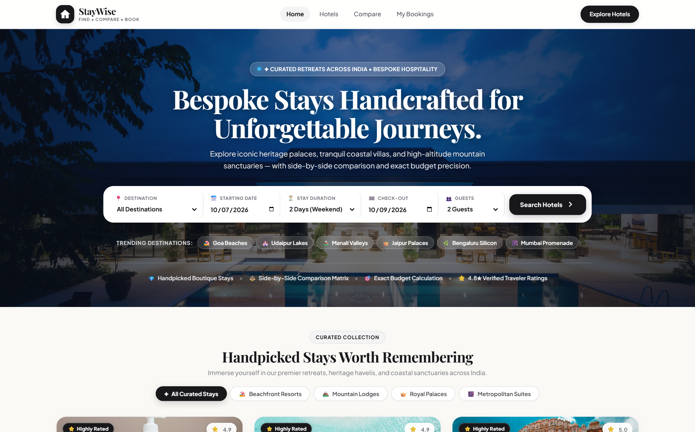
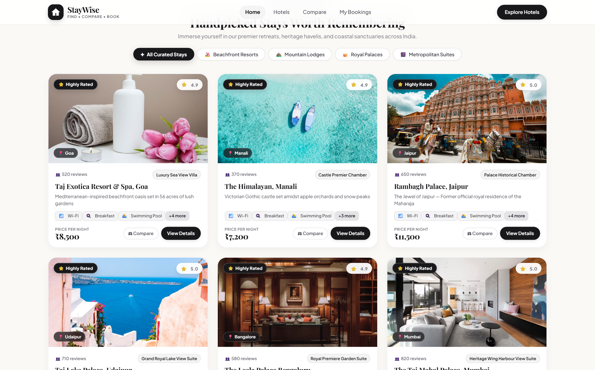
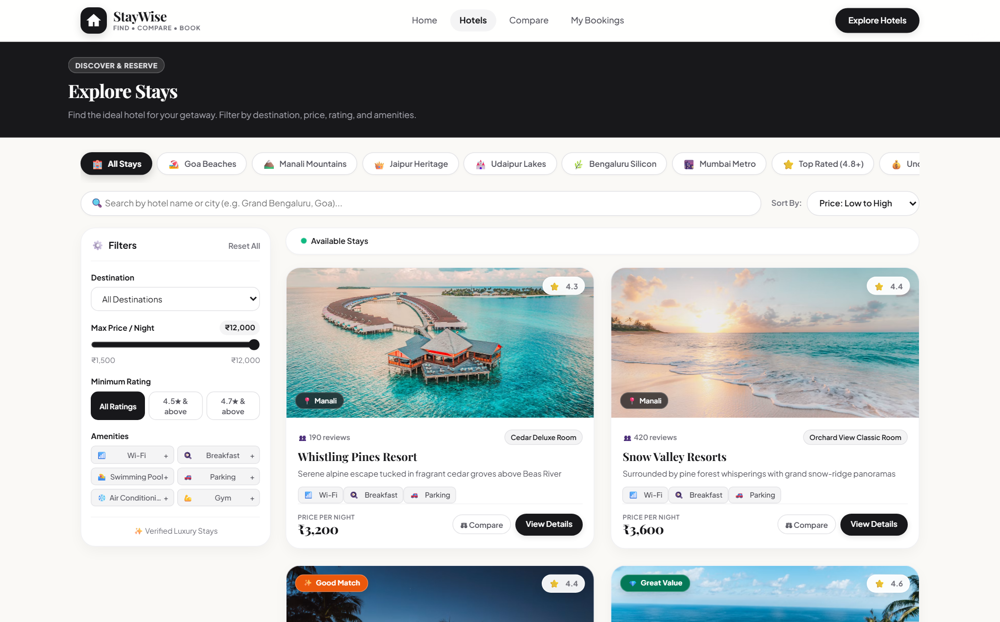
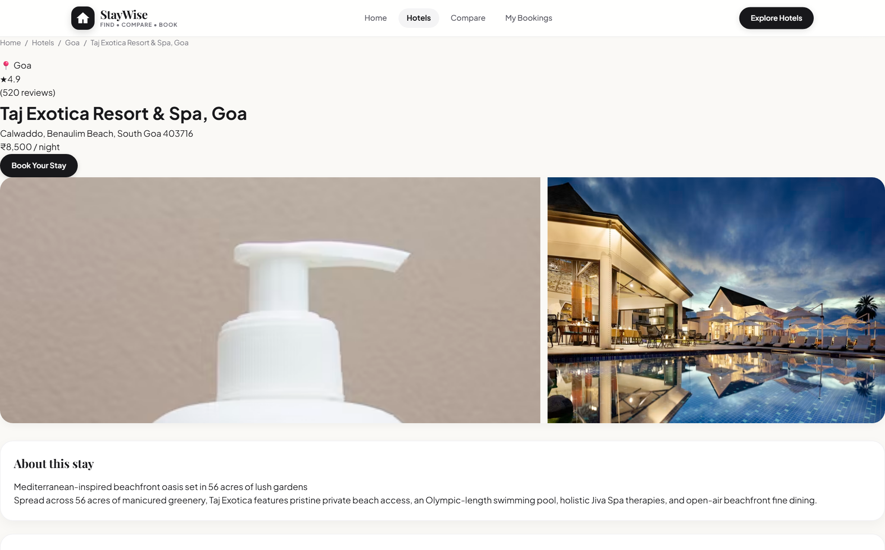
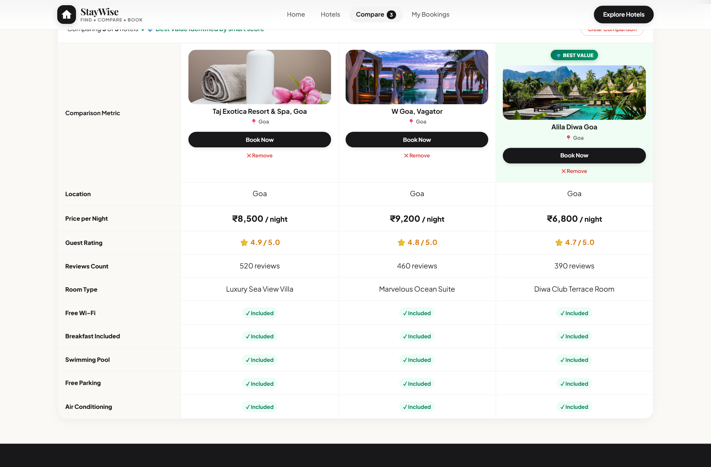
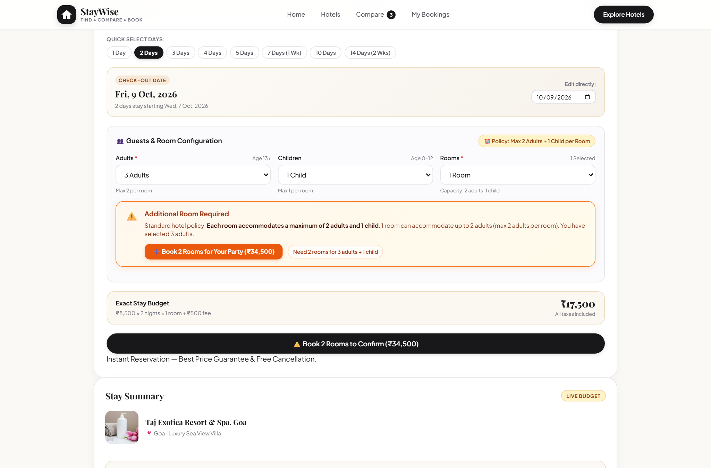
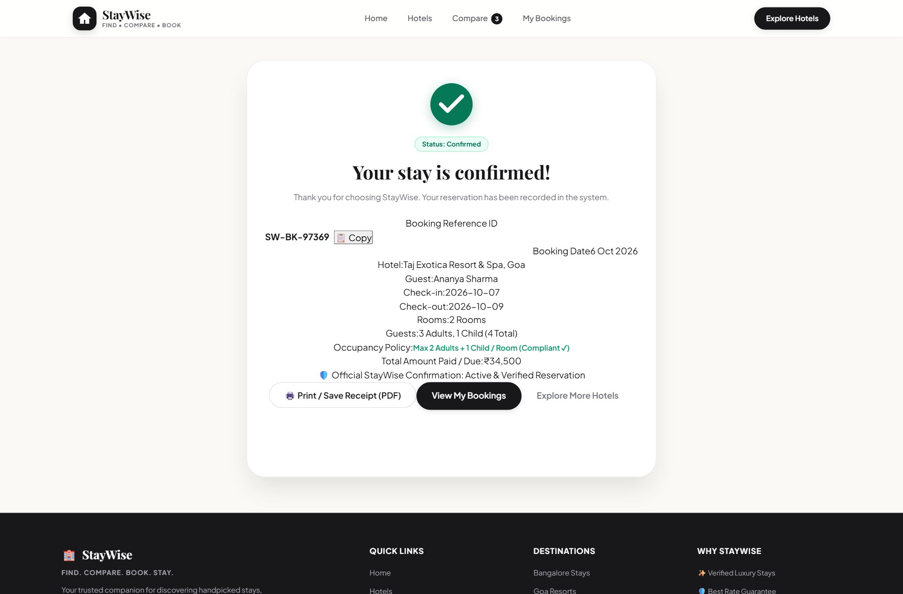
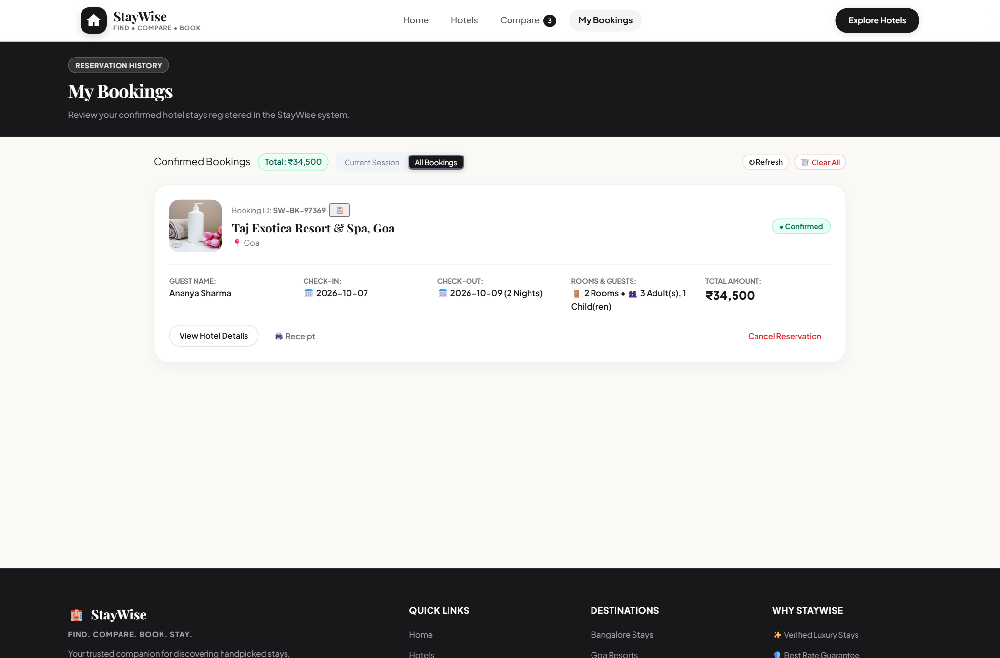
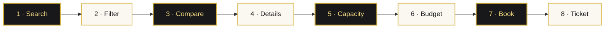

<div align="center">


<a href="#-curated-gallery">
  
</a>

<br />

<p>
  
  
  
  
  
</p>

<p>
  <a href="#-the-essence"><b>Essence</b></a> &nbsp;◆&nbsp;
  <a href="#-curated-gallery"><b>Gallery</b></a> &nbsp;◆&nbsp;
  <a href="#-signature-capabilities"><b>Capabilities</b></a> &nbsp;◆&nbsp;
  <a href="#-guest-journey"><b>Journey</b></a> &nbsp;◆&nbsp;
  <a href="#-system-architecture"><b>Architecture</b></a> &nbsp;◆&nbsp;
  <a href="#-getting-started"><b>Get Started</b></a> &nbsp;◆&nbsp;
  <a href="#-technical-insights"><b>Insights</b></a>
</p>

</div>


## ✦ The Essence

**StayWise** is hotel discovery for travelers who want extraordinary spaces, not generic listings. It pairs a **2026 Editorial Luxury** design language — *warm alabaster, obsidian ink, champagne-gold accents* — with total pricing clarity.

<div align="center">

| 🏛️ | 💰 | ⚖️ | 🛏️ | 🗄️ |
|:---:|:---:|:---:|:---:|:---:|
| **84** curated stays | **₹ exact** live budget | **3-way** comparison | **2 + 1** per room | **0** database daemons |
| 7 iconic Indian destinations | zero hidden fees | algorithmic Best Value | strict capacity guard | atomic JSON via REST |

</div>


## ✦ Curated Gallery

<div align="center">

<table>
  <tr>
    <td width="50%" align="center">
      <br />
      <strong>Cinematic Search Hero</strong><br />
      <sub>Destination selector, start-date picker & duration stepper</sub>
    </td>
    <td width="50%" align="center">
      <br />
      <strong>Curated Stays Showcase</strong><br />
      <sub>Editorial tags, verified nightly rates & luxury badges</sub>
    </td>
  </tr>
  <tr>
    <td width="50%" align="center">
      <br />
      <strong>Multi-Variable Discovery</strong><br />
      <sub>Price slider (₹1k–₹12k), amenities & rating tiers</sub>
    </td>
    <td width="50%" align="center">
      <br />
      <strong>Hotel Profile & Sticky Estimator</strong><br />
      <sub>High-res gallery with a real-time stay calculator</sub>
    </td>
  </tr>
  <tr>
    <td width="50%" align="center">
      <br />
      <strong>Side-by-Side Comparison Matrix</strong><br />
      <sub>3-property matrix with Best Value highlight</sub>
    </td>
    <td width="50%" align="center">
      <br />
      <strong>Booking Form & Capacity Guard</strong><br />
      <sub>Max 2 adults + 1 child, with 1-click room upgrade</sub>
    </td>
  </tr>
  <tr>
    <td width="50%" align="center">
      <br />
      <strong>Official Reservation Ticket</strong><br />
      <sub>Printable pass with verified booking reference</sub>
    </td>
    <td width="50%" align="center">
      <br />
      <strong>Guest Reservation History</strong><br />
      <sub>Persisted history drawer backed by the Express API</sub>
    </td>
  </tr>
</table>

</div>


## ✦ Signature Capabilities

### ⚖️ Side-by-Side 3-Hotel Comparison Matrix

Compare up to three hotels across price, rating, room type, location and six core amenities. A **Best Value** engine weighs price against rating and amenity depth to surface the optimal stay:

$$\text{Best Value Score} = \left(\frac{\text{Rating}}{\text{Nightly Price}} \times 10{,}000\right) + \text{Amenities Count}$$

### ⏱️ Stay Duration & Exact Budget Precision

No more error-prone checkout dates — pick a duration (*3, 7, 10 days…*) and StayWise derives checkout and totals to the rupee:

$$\text{Grand Total} = (\text{Nightly Rate} \times \text{Nights} \times \text{Rooms}) + \text{₹500 (service and booking fee)}$$

### 👥 Room Occupancy & Capacity Enforcement

Hospitality standards, enforced: **max 2 adults and 1 child per room.**

$$\text{Required Rooms} = \max\left(1,\ \left\lceil \tfrac{\text{Adults}}{2} \right\rceil,\ \text{Children},\ \left\lceil \tfrac{\text{Adults} + \text{Children}}{3} \right\rceil\right)$$

If a party exceeds capacity, an instant alert appears with a **1-click auto-upgrade** (`➕ Book N Rooms`).

### 🎯 Smart Badges & Multi-Variable Filtering

A real-time engine in `Hotels.jsx` updates the catalog across parameters simultaneously:

| Filter | Range / Options |
|:--|:--|
| 💸 **Price** | Slider, ₹1,000 – ₹12,000 |
| ⭐ **Rating tier** | 3★+ · 4★+ · 4.8★+ |
| 🛎️ **Amenities** | Wi-Fi · Breakfast · Pool · Fitness · Parking · A/C |
| 🏷️ **Auto badges** | *Best Value* · *Top Rated (4.8+)* · *Luxury Stay* · *Trending* |

### 🛡️ Fault-Tolerant Error Boundary

The whole React tree sits inside a self-healing `ErrorBoundary` (`getDerivedStateFromError` + `componentDidCatch`) — graceful fallback, **zero white screens**.


## ✦ Guest Journey



1. **Search** — choose destination, start date and trip duration.
2. **Filter** — real-time filtering by price, rating, city and amenities.
3. **Compare** — pin up to 3 hotels in the comparison drawer.
4. **Details** — browse the gallery with the sticky live estimator.
5. **Capacity** — max 2 adults + 1 child per room, with 1-click room adjustment.
6. **Budget** — transparent breakdown of stay cost, flat fee and nightly average.
7. **Book** — fast REST persistence on the Express backend.
8. **Ticket** — unique confirmation reference (`SW-BK-XXXXX`).


## ✦ System Architecture

```text
┌────────────────────────────────────────────────────────┐
│               REACT 18 FRONTEND (Vite)                 │
│                 http://localhost:3000                  │
│                                                        │
│  • React Router DOM v6       • Dynamic useMemo Filters │
│  • ErrorBoundary Resilience  • Pure CSS Design System  │
│  • Event-Driven State Sync   • Live Budget Calculator  │
└───────────────────────────┬────────────────────────────┘
                            │
                   HTTP / fetch() (JSON)
                            │
┌───────────────────────────▼────────────────────────────┐
│                EXPRESS REST API BACKEND                │
│                 http://localhost:5000                  │
│                                                        │
│  • CORS & JSON Middleware    • Strict Room Validation  │
│  • Hotel Catalog Routes      • Atomic Booking Engine   │
└───────────────────────────┬────────────────────────────┘
                            │
                     fs (Sync Read/Write)
                            │
┌───────────────────────────▼────────────────────────────┐
│                   JSON DATA STORAGE                    │
│                                                        │
│  • hotels.json (84 Stays)    • bookings.json           │
└────────────────────────────────────────────────────────┘
```


## ✦ Getting Started

> **Requirements:** Node.js 18+

**1 · Launch the backend**

```bash
cd backend
npm install
node server.js
# ➜ http://localhost:5000
```

**2 · Launch the frontend**

```bash
cd frontend
npm install
npm run dev
# ➜ http://localhost:3000
```


## ✦ Technical Insights

<details>
<summary><strong>Why is a Class Component used for ErrorBoundary?</strong></summary>
<br />

Error boundaries need `static getDerivedStateFromError()` to render fallback UI and/or `componentDidCatch()` to log errors. These lifecycle methods exist only in **Class Components** — hooks can't catch render-phase exceptions.
</details>

<details>
<summary><strong>How does StayWise enforce the room occupancy rule?</strong></summary>
<br />

Each room holds a **maximum of 2 adults and 1 child**.

$$\text{Required Rooms} = \max\left(1,\ \left\lceil \tfrac{\text{Adults}}{2} \right\rceil,\ \text{Children},\ \left\lceil \tfrac{\text{Adults} + \text{Children}}{3} \right\rceil\right)$$

- If guests exceed the selected rooms, an alert offers a 1-click room-count update.
- The Express backend **independently validates** occupancy on `POST /api/bookings` and rejects non-compliant requests with `400 Bad Request`.
</details>

<details>
<summary><strong>How is the Best Value score calculated?</strong></summary>
<br />

The engine balances guest satisfaction, price efficiency and amenity depth:

$$\text{Best Value Score} = \left(\frac{\text{Rating}}{\text{Nightly Price}} \times 10{,}000\right) + \text{Amenities Count}$$

The top-scoring property in the active comparison set receives the **Best Value** gold emblem.
</details>

<details>
<summary><strong>How is state synced across components without Redux?</strong></summary>
<br />

An event-driven storage pattern: when the Wishlist or Comparison collections change, `storage.js` writes to `localStorage` and emits a custom `staywise_storage_change` window event. Navigation bars and badge counters listen for it and update reactively.
</details>

<details>
<summary><strong>Why file-based JSON storage?</strong></summary>
<br />

It keeps the app self-contained, lightweight and runnable out of the box — no external database engine or background service required.
</details>

<br />

<div align="center">


<sub><b>StayWise</b> · Bespoke Editorial Luxury Hotel Discovery & Reservation Engine<br />Full-Stack · React 18 · Vite · Express</sub>

</div>
